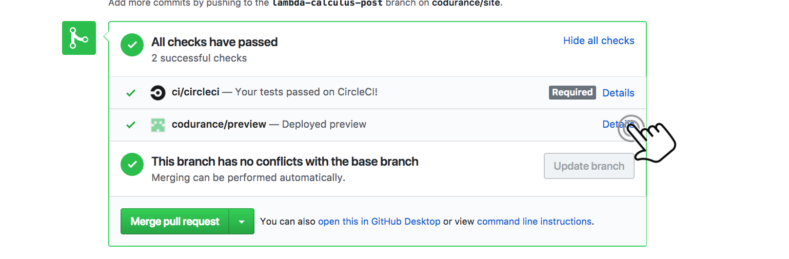

# [Codurance Web Site](https://codurance.com/)

## Setup the <del>development</del> writing environment 

You can serve the site through [docker](#installing-if-you-like-docker) or [natively](#installing-if-you-like-ruby) on your machine.

### Building if you like Docker

##### TL;DR
1. [Install docker](https://www.docker.com/community-edition)
1. [Install docker compose](https://docs.docker.com/compose/install/) (on Mac and Windows it comes with docker)

Build image:

    docker-compose build

Run container in a watch and auto rebuild mode:

    docker-compose up

Remove container:
    
    docker-compose down

Destroy container:

    docker-compose down

##### Detailed docker commands

You need to do this only once - this builds the image with all the dependencies inside.
If you change the project dependencies (Gemfile) then rebuild the image again.
    
    docker-compose build

Run this to run the container with only the latest posts (faster rebuild).
Source files are mounted inside the container from your host machine.
Site will be rebuilt automatically when you change the source code.

    docker-compose up

Open site:

    localhost:4000
    
Run this if you want all posts (slower rebuild):

    docker-compose -f docker-compose.yml up

If you want to start the container with a different command use:

    docker-compose run site <command>

Destroy the container and all volumes for this project.
Run this if your container is broken.

    docker-compose down

	
##### Notes for Windows users

As docker "18.06.0-ce-win72 (19098)", you need to setup COMPOSE_CONVERT_WINDOWS_PATHS environment variable and restart the docker service before running `docker-compose build`:

	SET COMPOSE_CONVERT_WINDOWS_PATHS=1
	net stop com.docker.service
	net start com.docker.service
	
Then you can run `docker-compose build`

Starting the container with `docker-compose up` doesnt seem to work but starting it with `docker run -p 4000:4000 -d <imageid>` does, the downside
is that you will have to run `docker-compose build`, `docker images` and `docker run -p 4000:4000 -d <imageid>` to check each update you make.
	
----

### Building if you like ruby

1. install rvm https://rvm.io/
- `rvm install ruby`
- `rvm use ruby`
- `gem install bundler`
- `bundle install`

run locally:

1. `bundle exec rake servequick`

In case of other problems, refer to the [troubleshooting section](#troubleshooting).

## Flight Rules

### Adding a post

  * Remember to add the tag `asset-type: post` to the post metadata

### Adding an abstract to a post

  * See [Jenkins example post](/site/blob/master/_posts/2014-10-03-guide-to-deploying-artifacts-with-jenkins.md), especially the ``abstract`` field.
  * Note: comments can only be single line
  * Note: Even if they are too long, they'll be cut to 30 words

### Adding a video to the publications

  * Add an md file to the folder: `videos/_posts` (You can use older videos post as a template)
  * Do not forget the attribute `video-url`, for youtube videos, use following format: https://www.youtube.com/embed/<video-id>
  * Add an image to the video, for youtube videos, make a screenshot [here](http://youtubescreenshot.com/), the image is used on the home page and the carousel. The image is to be saved under `/assets/custom/img/videos/`

## Previewing changes for a pull request

We have a bot that makes a preview of the site for every branch that you create. 

If you don't have a PR, you can just replace the branch name in the link below:

`http://codurance-site-pr.s3-website-eu-west-1.amazonaws.com/site-[branch-name]`

# Troubleshooting

## Header files for ruby not found

This problem happens with Linux systems:

    header files for ruby at /usr/lib/ruby/include/ruby.h not found

in case `ruby-dev` package is not installed:

    sudo apt-get install ruby-dev

## extconf.rb failed

`zlib` is necessary for building `libxml2`:

    sudo apt-get install zlib1g-dev

## Gem problems?

If other things don't make sense - follow this guide to clear out your cached gems and start the process again: https://coderwall.com/p/x3z2ag/cleanup-rvm

## Problems with installation of ffi gem on MacOS

To install ffi gem in the newer versions of MacOS you need install Xcode tool first. After restarting your terminal, the following command need to be executed:

    brew install libtool automake autoconf
